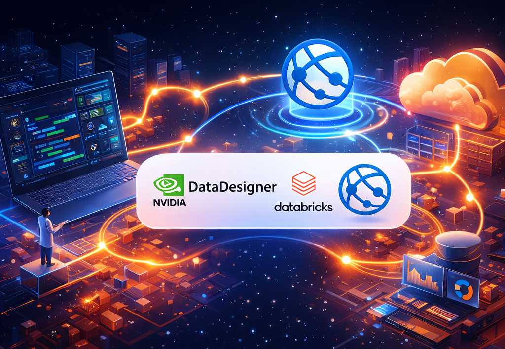
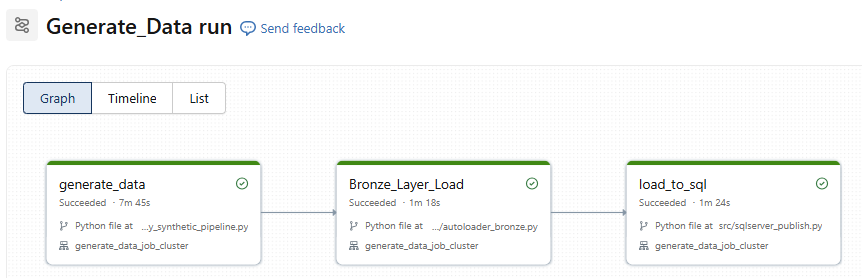
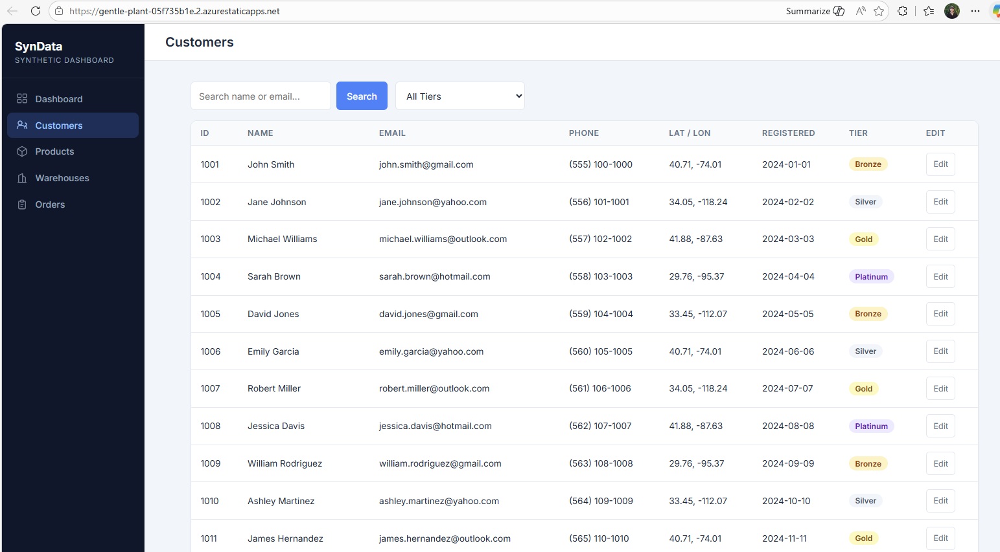

# Synthetic Web App

This Web App is an end-to-end project for generating realistic logistics and commerce data, landing it in Azure storage, processing it in Databricks, publishing it to Azure SQL, and serving it through an Azure Functions API and TypeScript frontend.

## Overview

The project models a synthetic commerce system with customers, products, warehouses, and orders. The pipeline uses NVIDIA NeMo Data Designer to generate realistic records, Azure Data Lake Storage for landing data, Databricks Auto Loader for incremental ingestion, Azure SQL for serving, and a lightweight web application for exploration.

At a glance, the platform covers:

- Synthetic data generation guided by explicit schemas and shipping logic
- Lake ingestion into Bronze Delta tables with Databricks Auto Loader
- Incremental publish into Azure SQL using watermark-based processing
- API access through Azure Functions
- A React and TypeScript frontend for browsing operational data

## Pipeline At A Glance

1. Define the synthetic entities and generation rules in [src/schemas.py](src/schemas.py) and [src/shipping_geo.py](src/shipping_geo.py).
2. Generate realistic datasets in [src/generate_realistic_data.py](src/generate_realistic_data.py).
3. Write scheduled JSON outputs to Azure Data Lake Storage in [src/daily_synthetic_pipeline.py](src/daily_synthetic_pipeline.py).
4. Ingest landed files into Bronze Delta tables with [src/autoloader_bronze.py](src/autoloader_bronze.py).
5. Incrementally publish Bronze data into Azure SQL with [src/sqlserver_publish.py](src/sqlserver_publish.py).
6. Orchestrate the downstream Databricks job with [src/autoloader_to_sql_pipeline.py](src/autoloader_to_sql_pipeline.py).
7. Expose the data through the Azure Functions API in [web/api/function_app.py](web/api/function_app.py).
8. Visualize and interact with the data in the frontend under [web/frontend](web/frontend).

## Repository Layout

- [src](src) contains the Python scripts that drive synthetic data generation, ADLS landing, Databricks ingestion, and SQL publishing.
- [web](web) contains the application layer: the Azure Functions API and the TypeScript frontend.
- [sql](sql) contains the database schema, table creation scripts, and schema evolution scripts for Azure SQL.
- [config](config) contains environment and configuration helpers used across the Python pipeline.
- [init-scripts](init-scripts) contains Databricks cluster setup scripts, including NeMo and ODBC installation.
- [data](data) contains local sample CSVs that support development and testing flows.
- [docs](docs) is the natural home for screenshots and additional documentation as the project evolves.

## Source Workflow

The [src](src) folder is the backbone of the platform. These are the main scripts in workflow order.

1. [src/client.py](src/client.py) configures the NVIDIA NeMo client used during synthetic generation.
2. [src/schemas.py](src/schemas.py) defines the core entities and fields that shape the generated datasets.
3. [src/shipping_geo.py](src/shipping_geo.py) adds warehouse, geography, and shipping-estimate realism.
4. [src/generate_realistic_data.py](src/generate_realistic_data.py) produces realistic records for the synthetic commerce domain.
5. [src/daily_synthetic_pipeline.py](src/daily_synthetic_pipeline.py) writes generated outputs to Azure Data Lake Storage in a scheduled, partition-friendly format.
6. [src/autoloader_bronze.py](src/autoloader_bronze.py) incrementally ingests landed JSON into Bronze Delta tables.
7. [src/sqlserver_publish.py](src/sqlserver_publish.py) publishes Bronze data into Azure SQL using watermark-based processing.
8. [src/autoloader_to_sql_pipeline.py](src/autoloader_to_sql_pipeline.py) runs the downstream ingestion and publish sequence together.

Supporting scripts include [src/generate_data.py](src/generate_data.py) for earlier generation flows.

## Application Layer

- [web/api](web/api) contains the Azure Functions backend, including SQL connectivity in [web/api/shared/db.py](web/api/shared/db.py).
- [web/frontend](web/frontend) contains the React and TypeScript user interface built with Vite.
- [.github/workflows/azure-static-web-apps-gentle-plant-05f735b1e.yml](.github/workflows/azure-static-web-apps-gentle-plant-05f735b1e.yml) contains the deployment workflow for the web application.

## Database Layer

The [sql](sql) folder contains the scripts used to bootstrap and evolve the Azure SQL schema.

- [sql/000_create_schema_syn_data.sql](sql/000_create_schema_syn_data.sql) creates the schema.
- [sql/001_create_customers.sql](sql/001_create_customers.sql), [sql/002_create_products.sql](sql/002_create_products.sql), [sql/003_create_orders.sql](sql/003_create_orders.sql), and [sql/005_create_warehouses.sql](sql/005_create_warehouses.sql) create the core tables.
- [sql/004_create_ingestion_watermark.sql](sql/004_create_ingestion_watermark.sql) supports incremental publish tracking.
- [sql/008_alter_add_shipping.sql](sql/008_alter_add_shipping.sql) extends older environments with shipping-related columns.

## Next Steps

Read more about the [web app here](https://x.com/rads__22/status/2047809888311771605?s=46)

